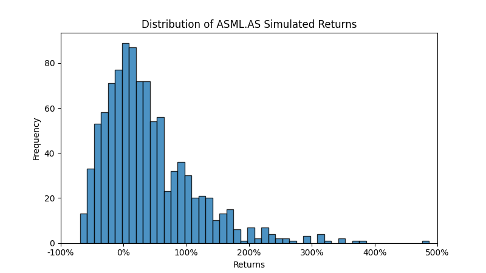

# Monte Carlo Simulation for Share Price Forecasting

## Introduction
This project implements a simple Monte Carlo simulation to forecast future share prices using historical data.

## Features
TBC

## Data Sources

### Share Price Data
The Monte Carlo simulations in this project are based on historical share price data from **Yahoo Finance**. The data includes daily openings, closings, intraday highs and lows, and volume information.

### Stocks Included
- **ASML Holding N.V. (ASML.AS)** - Data ranges from 20/07/1998 to 03/05/2024, share prices are in EUR.
- **LVMH Moët Hennessy Louis Vuitton S.E. (MC.PA)** - Data ranges from 03/01/2000 to 03/05/2024, share prices are in EUR.
- **Nestlé S.A. (NESN.SW)** - Data spans ranges 03/01/1990 to 03/05/2024, share prices are in CHF.
- **Novo Nordisk A/S (NOVO-B.CO)** - Data ranges from 06/01/2001 to 03/05/2024, share prices are in DKK.
- **Shell plc (SHEL.L)** - Data ranges from 29/08/1996 to 03/05/2024, share prices are in GBp.

For more details on the data used in this project, please see the README in the [data directory](data/README.md).

## Getting Started
### Prerequisites
TBC

### Installation
TBC

### Usage
Run the simulation:
```shell
python src/main.py --ticker <stock_ticker> --iterations <num_price_paths> --days <num_trading_days>
```

## Results
The following are example results from running the simulation as follows:
```shell
python src/main.py --ticker ASML.AS --iterations 1000 --days 252
```





## Contact
Benjamin Szekeres – [benjamin.a.szekeres@gmail.com](mailto:benjamin.a.szekeres@gmail.com)
