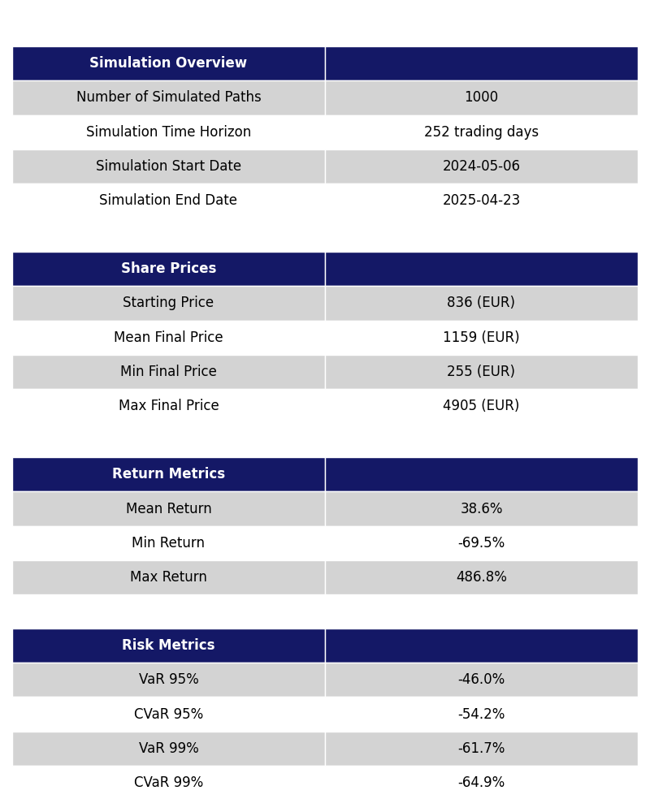

# Monte Carlo Simulation for Share Price Forecasting

## Introduction
This project implements a simple Monte Carlo simulation to forecast future share prices using historical data.

## Features
TBC

## Data Sources

### Share Price Data
The Monte Carlo simulations in this project are based on historical share price data from **[Yahoo Finance](https://uk.finance.yahoo.com/)**. The data includes daily openings, closings, intraday highs and lows, and volume information.

### Stocks Included
- **ASML Holding N.V. (```ASML.AS```)** - Historical data ranges from 20/07/1998 to 03/05/2024, share prices are in EUR.
- **LVMH Moët Hennessy Louis Vuitton S.E. (```MC.PA```)** - Historical data ranges from 03/01/2000 to 03/05/2024, share prices are in EUR.
- **Nestlé S.A. (```NESN.SW```)** - Historical data ranges 03/01/1990 to 03/05/2024, share prices are in CHF.
- **Novo Nordisk A/S (```NOVO-B.CO```)** - Historical data ranges from 06/01/2001 to 03/05/2024, share prices are in DKK.
- **Shell plc (```SHEL.L```)** - Historical data ranges from 29/08/1996 to 03/05/2024, share prices are in GBp.

For more details on the data used in this project, please see the README in the [data directory](data/README.md).

## Getting Started
### Prerequisites
- Python 3.8+

### Installation
TBC

### Usage
Run the simulation:
```shell
python src/main.py --ticker <stock_ticker> --iterations <num_price_paths> --days <num_trading_days>
```

## Results
The following are example results from running the simulation as follows:
```shell
python src/main.py --ticker ASML.AS --iterations 1000 --days 252
```

**Figure 1: Summary of a Monte Carlo simulation for ASML.AS over 252 trading days and 1000 price paths**



**Figure 2: Future price paths predicted by the Monte Carlo simulation**


**Figure 3: Historical and future price paths predicted by the Monte Carlo simulation**


**Figure 4: Distribution of returns from the Monte Carlo simulation**


**Figure 5: Box plot of the Monte Carlo simulation at four chosen dates**


## Contact
Benjamin Szekeres – [benjamin.a.szekeres@gmail.com](mailto:benjamin.a.szekeres@gmail.com)
